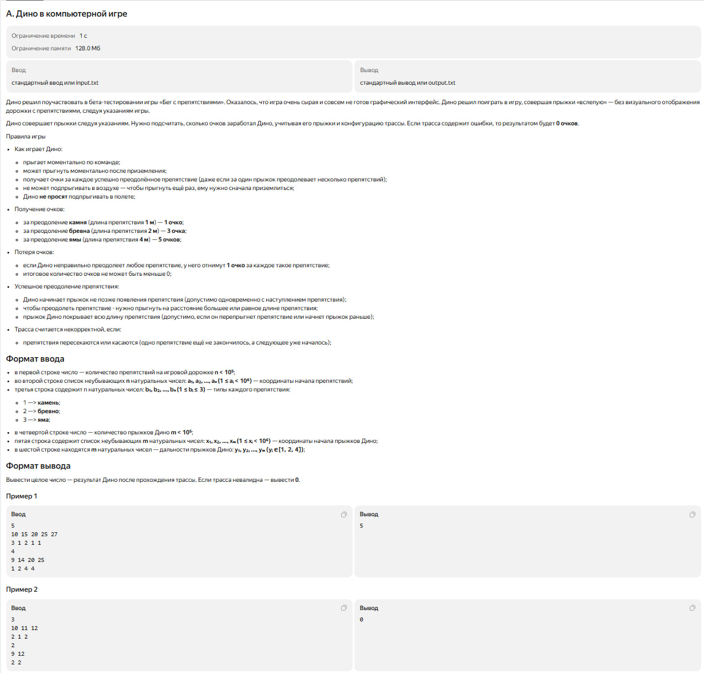

### Условие задачи


### Running tests
Run tests like:
```
gc tests/test1.txt | python solution.py 
gc tests/test2.txt | python solution.py
gc tests/test3.txt | python solution.py
gc tests/test4.txt | python solution.py
```